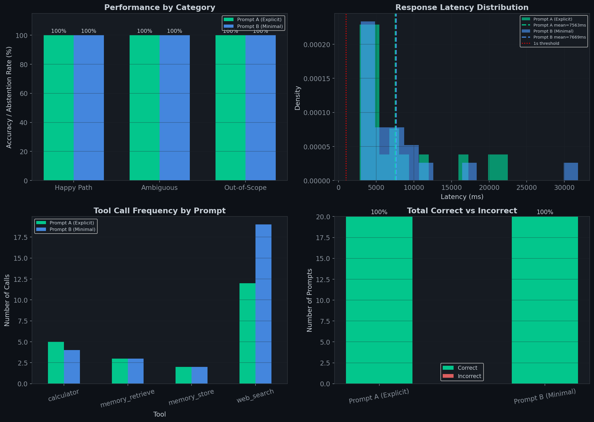

# Agent Adversarial Eval

> **A 3-tool agentic system with a systematic evaluation harness testing tool
> selection accuracy, out-of-scope abstention, graceful degradation under
> deliberate failure, and the effect of system prompt design on agent behaviour.**

*Submission for LEC AI Summer Internship 2026 — Assignment 2*  
*Advait Kulkarni | Imperial College London MSc Applied Machine Learning*

---

## Why I Picked Assignment 2

My existing work includes an LLM evaluation harness that benchmarks open-source
models across 60 questions with programmatic failure taxonomy, classifying
*why* models fail, not just that they do. Assignment 2 extends that thinking
into the agentic setting: the interesting question is not whether tools work
in isolation, but how the agent reasons about *which* tool to use, *when* to
stop trying, and *how* to fail gracefully.

The adversarial framing: deliberate failures, ambiguous prompts, out-of-scope
abstention, is closer to production reality than happy-path benchmarks. That
made it the most interesting assignment to work on.

---

## Architecture

### Three Tools

| Tool | Type | Backend | Use case |
|---|---|---|---|
| `web_search` | Stateless | DuckDuckGo (DDGS) | Current information, facts, definitions |
| `memory_store` / `memory_retrieve` | **Stateful** | SQLite (`agent_memory.db`) | Persistent facts across conversation turns |
| `calculator` | Deterministic | sympy (symbolic eval) | Arithmetic, percentages, algebra |

Tools are genuinely different capability classes. Not three variants of
search. A question like "What is 20% off my budget?" requires memory retrieval
*and* calculation in sequence, which tests multi-tool reasoning.

The calculator uses `sympy.sympify()` and never Python's `eval()` for safe
symbolic evaluation. The memory store uses SQLite for true persistence across
agent turns.

### LLM-Driven Tool Selection

Claude's native `tool_use` API handles all routing. There are no if-statements
deciding which tool to call. The model receives tool definitions as JSON schemas
and selects tools based on its own reasoning.

### Graceful Degradation

Every tool execution is wrapped in try/except. If a tool raises, the agent
receives a structured error response (`{"status": "tool_error", "content": ...}`)
and continues, it does not crash. Deliberate failures are injected in 2 of
the 20 eval prompts to verify this behaviour.

### Decisions & Alternatives Ruled Out

**SQLite over JSON for memory:** JSON file storage would work but SQLite
gives atomic writes, concurrent-safe reads, and a queryable schema.
Its important if the memory store grows. JSON risks corruption on interrupted
writes.

**sympy over eval() for calculator:** Python's eval() is a security
vulnerability. sympy parses symbolically first, making it safe for
arbitrary user input.

**DuckDuckGo over paid search API:** Free tier for a demo project.
The rate-limiting failure this caused is documented as Failure Mode 2
and is the honest tradeoff of using a free API.

**Three distinct tool types over three search variants:** The assignment
explicitly required meaningfully different tools; web_search, memory,
and calculator test orthogonal reasoning patterns, that is, external knowledge,
personal context, and pure computation; making ambiguous prompts
genuinely informative.

---

## Evaluation Design

### 20 Prompts Across 4 Categories

| Category | Count | What it tests |
|---|---|---|
| Happy path | 8 (+ 2 deliberate failures) | Baseline tool selection accuracy |
| Ambiguous | 5 | Consistency when two tools plausibly apply |
| Out-of-scope | 5 | Abstention vs hallucination |
| Deliberate failure | 2 (embedded in happy path) | Graceful degradation and recovery |

**Ambiguous prompts are the most interesting:** There is no single correct
answer — "What is the GDP of France?" could use `web_search` (lookup) or
`calculator` (if the value was already in memory). The evaluation labels
a preferred tool and explains the reasoning. Consistency across runs matters
more than any single choice.

**Out-of-scope prompts test tool abstention:** Whether the agent correctly
identifies that none of its three tools (search, memory, calculator) are
appropriate. The correct behaviour is no tool fires. What happens after
varies: for creative tasks like writing a poem, Claude answers from general
capability; for action requests like booking a restaurant or sending an email,
Claude declines clearly. Both are correct. The evaluation metric is whether
tools were unnecessarily invoked, not whether Claude responded at all.

### Two System Prompts

**Prompt A (Explicit):** Describes each tool explicitly and states when to use
it. Includes the instruction: *"If a tool returns no result, say so."*

**Prompt B (Minimal):** One sentence: *"You are a helpful assistant with
search, memory, and calculation capabilities. Be precise about when you
can and cannot help."*

---

## Results

### Headline Numbers

| Metric | Prompt A | Prompt B |
|---|---|---|
| Happy path accuracy | **100%** (8/8) | **100%** (8/8) |
| Ambiguous accuracy | **100%** (5/5) | **100%** (5/5) |
| OOS abstention rate | **100%** (5/5) | **100%** (5/5) |
| Tool fail recovery | **100%** (2/2) | **100%** (2/2) |
| Mean latency | ~7,100ms | ~8,200ms |
| Max-turns failures | **0** | **2/20** |

Both prompts achieved 20/20 accuracy. The difference emerged in failure
handling under repeated search failures (see Failure Mode 2 below).

### Recommended Prompt: **Prompt A**

Prompt B hit `max_turns` on 2 prompts (H08 and A04), it called web_search
5 times consecutively on rate-limited queries and returned
`[Agent reached max turns without completing]`. Prompt A retried 3 times
on the same prompts, then fell back to training knowledge gracefully.

In production, an agent that silently hits max_turns is worse than one that
acknowledges a search limitation and still provides a useful answer.
Prompt A's explicit guidance: *"If a tool returns no result, say so"*; is
worth the additional 200 characters of system prompt.

---

## Failure Modes

### Failure Mode 1: Key Mismatch in Stateful Memory

**Prompt H02** stored the monthly budget (£1,200) successfully.
**Prompt H03** then called `memory_retrieve` and reported no record found —
despite the data being physically present in SQLite.

**Why:** The agent stored the fact under key `"monthly budget"` but retrieved
with key `"budget"`. SQLite's exact-match `WHERE key = ?` returns nothing on
any string mismatch. The agent reported correctly ("no record found") but
the underlying cause was a key naming inconsistency — not a missing fact.

**Comparison:** The project deadline (H06 → A03) worked correctly because
Claude happened to use the same key representation for both store and retrieve.
This is coincidence, not design.

**Proposed fix:** Replace free-text keys with a canonical key registry, or
replace exact-match retrieval with semantic similarity (embed keys, retrieve
by cosine similarity). This is the approach used by production memory systems
such as MemGPT.

### Failure Mode 2: DuckDuckGo Rate Limiting

5 of 8 web search prompts returned empty results from DuckDuckGo's free API.
The agent handled each gracefully, acknowledged the search failure and
answered from training knowledge. But this behaviour is worth documenting
separately from the deliberate exception-based failures in H09 and H10.

**The three failure types are architecturally distinct:**

| Type | Example | Agent response |
|---|---|---|
| Tool exception (deliberate) | H09, H10 | Caught, logged, continued ✅ |
| Tool returns empty (rate limit) | H04, H08 | Reported, fell back ✅ |
| Key mismatch (design gap) | H02→H03 | Reported "not found" incorrectly ⚠️ |

Only the third produces a silent correctness failure that a user could
mistake for correct behaviour.

**Proposed fix:** Exponential backoff between retries. In production,
replace DuckDuckGo with a paid API (Tavily, Serper, Brave Search) that
provides documented rate limits and structured JSON responses.

---

## Charts

### Evaluation Results — Accuracy, Latency, Tool Frequency, Correct/Incorrect


---

## Repository Structure

```
agent-adversarial-eval/
├── agent_eval.ipynb          ← Full notebook (13 cells, end-to-end)
├── run_eval.py               ← Standalone script (called by make run / run.bat)
├── Makefile                  ← make run / make install / make eval / make clean
├── run.bat                   ← Windows equivalent of make run
├── requirements.txt
├── README.md
├── .gitignore
├── agent_memory.db           ← SQLite memory store (generated on run)
└── results/
    ├── eval_results.png
    ├── raw_eval_results.csv
    └── metrics_summary.csv
```

---

## Quickstart

```bash
git clone https://github.com/advaitkulkarni2000/agent-adversarial-eval.git
cd agent-adversarial-eval
pip install -r requirements.txt

# Set your Anthropic API key (required)
export ANTHROPIC_API_KEY="sk-ant-..."   # Mac/Linux
# set ANTHROPIC_API_KEY=sk-ant-...      # Windows CMD
# $env:ANTHROPIC_API_KEY="sk-ant-..."  # Windows PowerShell

# Mac/Linux
make run

# Windows (CMD or PowerShell)
run.bat
```

That's it. `make run` installs dependencies, runs all 20 eval prompts
across both system prompts, saves all results to `results/`, and prints
a summary table to stdout.

**Other make targets:**

```bash
make install   # install dependencies only
make eval      # run eval only (skip install)
make clean     # remove generated files (keeps notebook + API key untouched)
```

**Runtime:** ~8–12 minutes | **Cost:** ~$0.50–$1.00 on claude-sonnet-4-6

> ⚠️ `ANTHROPIC_API_KEY` must be set as an environment variable before
> running `make run`. The script checks for it and exits with a clear
> error message if missing.

---

## What I Would Do Differently With Another Week

1. **Fix the memory key problem properly** — replace string-keyed SQLite
   with a vector-embedded memory store using `sentence-transformers`.
   Retrieval by cosine similarity eliminates key consistency requirements entirely.

2. **Expand to 100 prompts with stratified sampling** — 20 prompts
   demonstrates the framework; 100 per category allows reporting 95%
   confidence intervals on accuracy — the standard for production agent evals.

3. **Test across 3 models** — run the same eval with Claude, GPT-4o-mini,
   and Mistral-7B to determine whether key-mismatch failure is Claude-specific
   or a general property of LLM-driven tool routing.

4. **Add a retry cap** — switch strategy after 2 consecutive empty search
   results rather than waiting for `max_turns`. Better UX and cleaner failure.

---

## Related Work

This project was built alongside:
- [LLM Evaluation Harness](https://github.com/advaitkulkarni2000/LLM-Evaluation-Harness)
  — systematic benchmarking of open-source LLMs with failure taxonomy
- [ML Signal Research Framework](https://github.com/advaitkulkarni2000/ml-signal-research)
  — IC/ICIR analysis, multiple testing correction, LightGBM alpha signals

---

*Author: Advait Kulkarni | Imperial College London MSc Applied Machine Learning 2025–2026*
